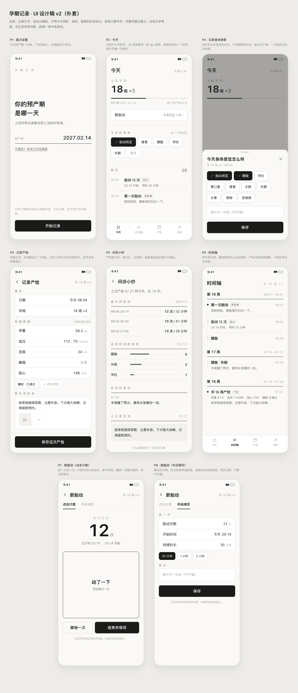
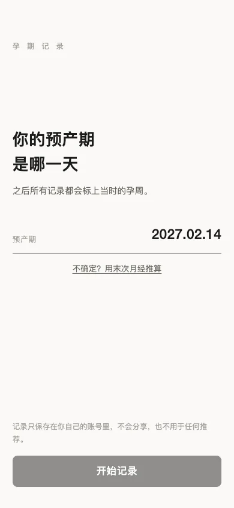

「等你日记」是一款面向孕期个人记录的微信小程序。它把身体感受、胎动、产检和重要时刻放进同一条时间线，希望在信息很多、情绪也容易波动的阶段，提供一个安静、直接的记录入口。

*真实项目设计稿：从首次设置、今日记录、产检与问诊小抄，到按孕周组织的时间线和两种胎动记录方式。*

## 先解决每天会发生的记录

首页围绕“今天”组织信息：当前孕周、距离下次产检的时间、最近记录和快速入口都在同一屏完成。身体感受可以通过标签快速选择，也可以补充一句备注；胎动既支持点击计数，也允许手动填写次数和时长；产检记录则保存项目、指标和医生建议。

*真实界面：首次进入只询问一个决定后续孕周计算的必要信息，并在提交前说明记录的私密边界。*

这些记录会按孕周合并到时间线中。用户可以把某次身体记录、胎动或产检保存为里程碑，也可以回到原记录继续编辑和删除，不需要在多个互不关联的模块之间寻找。

## 克制的视觉语言

界面使用低饱和的米白、黑灰与植物元素，减少大面积状态色和装饰性卡片。重要操作保持明确，但尽量不制造“必须完成任务”的压力。产检数据以直接可读的字段呈现，身体感受和胎动则使用更轻的交互，让高频记录不需要填写复杂表单。

产品只承担记录与整理，不给出医学判断。界面中的相关位置明确提示：记录不构成医学建议，有疑问应咨询医生。

## 微信身份与隐私边界

小程序通过 `wx.login` 获取临时 code，由服务端与微信交换身份并签发自己的不透明会话令牌。微信密钥只存在服务端，所有记录接口都根据当前会话隔离用户；访问不属于自己的记录统一返回 `404`，避免暴露资源是否存在。

昵称和头像只有在用户明确授权后才会保存。账号数据可以导出为版本化 JSON，但归档不包含 openid、unionid、会话令牌和未持久化照片。用户主动退出后，客户端会保留退出状态，不会在刷新时自动重新登录。

## 处理移动端重试与数据冲突

移动网络下，请求超时和重复提交都很常见。新记录使用用户范围内的 `clientRecordId` 保证幂等：相同 ID 和相同内容的重试不会生成重复数据，相同 ID 但内容不同则返回冲突。

编辑记录时，客户端提交 `expectedUpdatedAt`。如果服务端数据已经被更新，本次写入会被拒绝，避免旧页面静默覆盖更新后的内容。会话过期后，客户端只自动重新登录并重试原请求一次，防止无限刷新或重复写入。

## 工程结构与当前状态

项目使用 Turborepo 组织 Taro React 小程序、Hono API 和 Drizzle 数据包，开发环境使用 SQLite，数据层可切换到 Turso。认证、个人资料、数据导出和时间线相关接口已经形成完整链路。

当前版本仍在持续完善。产检照片暂时只做本地预览，尚未接入持久化上传；这项能力会等存储、访问控制和删除策略一起明确后再开放，而不是先把敏感图片传到一个边界不清楚的服务中。
