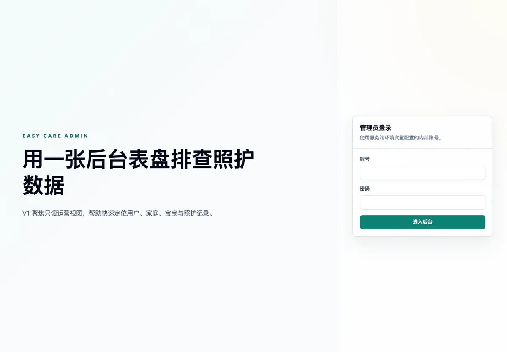

Easy Care 从一个很具体的问题开始：当宝宝的喂养、睡眠、尿布和成长信息散落在聊天记录与不同工具中，照护者很难看见完整的一天，也很难在多人协作时保持记录一致。

项目把微信小程序作为家庭成员的日常入口，同时提供 NestJS API 和 React 管理后台。重点不是增加更多记录表单，而是让高频记录足够快，让家庭、宝宝和照护者之间的权限关系始终清楚。

*真实界面：管理后台使用独立的内部账号入口，第一版聚焦只读运营视图，不与家庭端共用身份体系。*

## 产品边界

小程序覆盖家庭空间、多宝宝档案、喂养与睡眠记录、单日时间线、生长发育和儿保防疫计划。所有信息都服务于家庭日常照护，不把记录结果包装成医疗判断；订阅提醒也需要用户明确授权后才会发送。

管理后台负责用户、家庭、宝宝和记录的查询与维护，但权限判断不会只留在前端。API 会根据当前用户和家庭关系校验资源访问范围，避免仅凭一个记录 ID 读取其他家庭的数据。

## 一条记录如何进入家庭时间线

日常记录的入口被压缩到几次点击内：照护者先选择当前宝宝，再记录喂养类型、睡眠区间、尿布状态或补剂。服务端在写入时同时保存家庭、宝宝、操作者和发生时间，首页时间线则按宝宝与日期重新组合这些事实。

多人照护意味着“谁记录、记录属于哪个家庭、成员离开后还能否访问”不能靠界面约定。家庭邀请、加入、移除和主动离开都经过服务端关系校验；成员关系变化后，后续查询会立即按新的家庭边界裁剪，而不是继续信任客户端缓存的家庭 ID。

## 工程结构

项目采用 TypeScript Monorepo：Taro React 负责微信小程序，NestJS 处理业务接口，Prisma 管理 PostgreSQL 数据，前后端通过共享包复用枚举和领域模型。传输层、业务逻辑和数据访问保持分离，让小程序与管理后台可以共享契约，又不会把服务端实现泄露到客户端。

数据库变化通过 migration 管理。儿保和疫苗计划使用可重复执行的回填任务补齐旧数据，并保留用户已经预约、完成或隐藏的状态。服务端同时加入登录与邀请限流、慢请求日志、Swagger 访问限制，以及面向私有对象存储的头像方案。

管理后台采用与小程序分离的认证入口，生产环境可以关闭 Swagger 并限制允许访问的 IP。用户头像保存在私有对象存储时，数据库只记录受控对象路径，读取仍由 API 代理鉴权，避免把长期公开地址散落到客户端。

## 当前结果

目前已经形成从微信登录、家庭协作、日常记录到成长计划的完整路径。本地环境可以通过 Docker PostgreSQL 复现，API、小程序和管理后台分别具备测试与构建脚本；生产配置则明确区分数据库 SSL、密钥、合法域名和对象存储权限。

仍在推进的部分主要是媒体能力和真实家庭试用：宝宝照片需要与对象权限、缩略图、删除同步和隐私审计一起上线；订阅提醒也必须在用户明确授权后发送。当前版本因此先保证结构化记录可靠，不用一个“上传成功”的界面掩盖尚未闭环的隐私边界。
