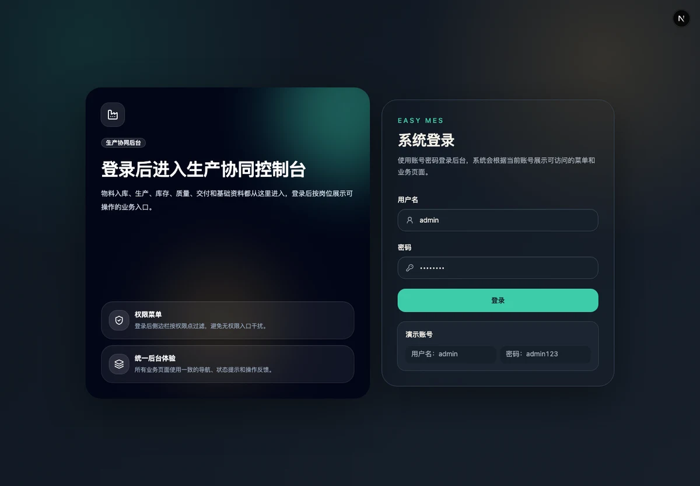

Easy MES 是一个面向小型轴承工厂的制造执行系统。第一阶段不追求覆盖所有制造场景，而是围绕一条真实生产链路，把原材料如何进入工厂、经过哪些工序、形成哪个成品批次，以及最终交付给谁记录清楚。

*真实界面：系统登录页明确展示入口范围；登录后菜单与业务操作会继续按岗位权限收敛。*

## 从原材料到交付的业务闭环

系统从采购来料或客户供料入库开始。来料检验确认批次质量状态后，生产工单进入下料环节：原材料库存被扣减，同时生成可继续流转的半成品批次。

需要外协的批次通过委外加工单发出，进入外协虚拟仓；回货后先形成待检批次，再根据检验结果处理合格、部分合格或不合格数量。回到车间的物料经过领料、员工报工、终检和完工入库，最终由交付订单扣减成品库存并形成交付记录。

这条链路涉及仓库、采购、质检、生产、委外、车间和管理人员。后台因此按业务阶段组织，而不是把所有单据堆进同一张菜单：每个岗位只看到需要处理的入口和允许执行的动作。

## 批次追溯不是一张结果表

只保存当前库存余额，无法回答材料经历过什么。Easy MES 要求所有影响库存的业务动作同时写入库存流水，并保留父子批次与来源单据关系。

原材料批次、下料产出、委外回货、车间领料、完工批次和交付记录可以沿真实业务链路追溯。单据号、批次号、生产工单号、委外单号与交付单号共同构成查询入口，避免为了展示一张“追溯图”而生成数据库中并不存在的节点。

## 委外与质量状态

小型制造企业的外协环节常常同时影响数量、库存位置和质量状态。系统使用外协虚拟仓表达已经离开本厂、但尚未完成回货确认的物料；发出、回货和检验分别记录，不能用一次状态修改覆盖整个过程。

质检也不是简单的通过或拒绝。来料、外协和终检分别发生在不同阶段，检验结果会决定批次是否可继续流转，并保留对应的质量异常记录。这让“还有多少未回”“哪些数量待检”和“哪一批成品可以交付”成为可以独立核对的问题。

## 权限与数据范围

系统同时维护角色、权限点、菜单守卫和后端权限守卫。前端菜单只负责减少无关入口，真正的操作权限仍由 API 校验。车间、本人与全厂等数据范围通过专门的 smoke 测试验证，避免用户绕过页面后直接读取不属于自己岗位的数据。

关键业务动作写入审计日志。库存扣减、重复提交和跨范围访问等边界通过主链路、数据范围和业务规则 smoke 覆盖，确保错误不会只表现为界面提示，而是被服务端规则真正阻止。

## 工程结构与上线准备

项目使用 pnpm workspace：Next.js 管理后台负责现场操作与查询，NestJS API 承担领域规则和权限，Prisma 管理 PostgreSQL 数据，共享包维护响应类型、错误码和业务字典。

除类型检查、lint 和构建外，仓库还提供权限一致性检查、上线环境静态检查、API 主链路 smoke、UI smoke，以及数据库备份和恢复脚本。当前脚本与 Runbook 已接入，但目标环境中的真实备份恢复演练仍待完成，因此项目不会把“有恢复脚本”描述成“已经验证可恢复”。

## 当前状态

第一阶段已完成主数据、采购来料、批次库存、生产下料、委外、车间报工、终检、完工入库、交付、报表、计件工资和审计日志的基础闭环。复杂 APS、设备联网、SPC、多工厂、财务结算和图谱化追溯明确留在后续阶段。

这个项目让我更清楚地认识到，制造系统首先要忠实记录现场事实。只有数量、位置、质量状态和批次关系都可以解释，后续的排产、分析和自动化才有可靠基础。
