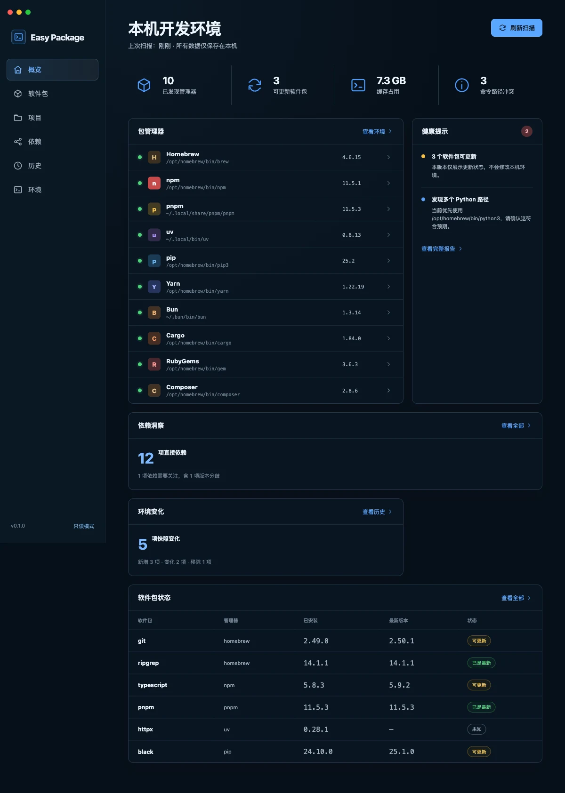
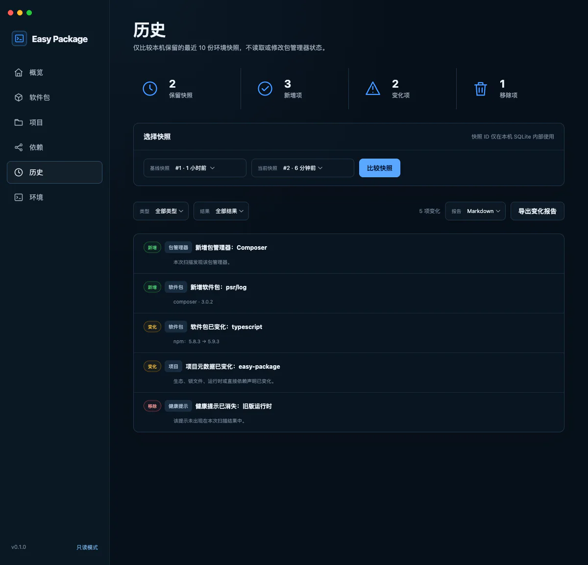

Easy Package 是一个 macOS 本机开发环境面板。它把原本散落在终端命令里的软件包、运行时、PATH 和项目依赖整理到同一处，同时保留开发工具应有的透明度：看得到来源、知道将要执行什么，也能追溯环境发生过哪些变化。

*真实界面：一次扫描后的环境概览，集中展示管理器、可更新软件包、缓存占用、PATH 冲突与最近环境变化。*

## 为什么做这个项目

一台长期使用的开发机通常会同时存在 Homebrew、npm、pnpm、Cargo、uv、pip 等管理器。时间久了，同一个命令可能来自不同路径，运行时版本和项目声明也可能不再一致。问题往往不会立刻报错，而是在安装、构建或切换项目时表现成难以定位的环境差异。

Easy Package 试图提供一个比“重新安装一遍”更稳妥的入口：先扫描和解释现状，再决定是否修改。

## 核心体验

应用启动后不会自动执行修复，而是先建立一份本机快照。概览页集中展示已经发现的管理器、可更新软件包、缓存占用和 PATH 冲突；需要深入时，可以继续查看单个管理器、运行时来源或项目详情。

项目工作区是按需添加的。应用只读解析 JavaScript、Python、Rust、Go、Ruby 和 PHP 等生态的 manifest 与锁文件，并检查运行时匹配、重复版本、本地引用和依赖循环。npm、pnpm 与 Cargo 项目还可以构建完整依赖图，或导出 CycloneDX 1.6 SBOM。

## 把安全边界做成产品流程

开发环境工具一旦具备写能力，就需要比普通信息面板更谨慎。Easy Package 的写操作遵循同一条路径：

1. 检查当前管理器和操作能力。
2. 生成固定命令计划，明确展示命令和风险。
3. 等待用户二次确认后执行。
4. 完成后重新扫描，对比操作前后的快照。

应用不经过 Shell，不接受任意参数，也不主动请求 `sudo`。可执行文件通过白名单与内容指纹校验；npm 和 pnpm 写操作固定关闭 lifecycle scripts。发生中断或异常时，后续写入会被阻止，直到重新扫描确认状态。

## 本地优先的数据设计

扫描结果、历史快照和审计记录保存在本机 SQLite。应用默认离线，只有用户明确允许 registry 检查后才会访问软件包目录；导出的环境报告会把主目录替换成 `~`，避免把本机绝对路径带到外部文档。

*真实界面：历史页比较两次本机快照，把新增、变化、移除和健康提示分开呈现，并允许导出脱敏后的变化报告。*

前端使用 React 呈现环境与操作状态，Tauri 负责桌面壳和系统能力，Rust 承担扫描、校验与受控写入。这个边界让界面层不直接拼装系统命令，也让核心行为能够独立测试。

## 当前状态

项目已经发布 `v0.1.0`，可通过 GitHub Releases 下载 macOS DMG。当前版本覆盖环境扫描、软件包管理、项目依赖分析、运行时发现、历史快照和安全操作中心；安装包尚未进行 Apple 签名与公证，因此首次打开仍需要用户在系统设置中确认。

这个项目让我更明确地看到：开发工具的价值不只是“能执行命令”，更在于让执行前后的状态足够清楚，让用户始终知道工具做了什么、没有做什么。
