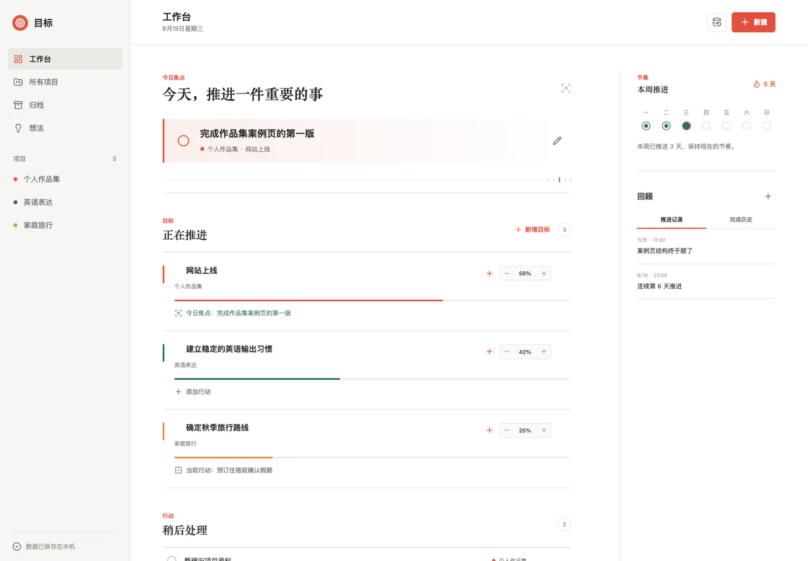

Easy Target 不是为了管理团队，而是帮助一个人持续推进手上的项目。它把目标、行动和每天留下的推进记录放在同一个上下文中，让“现在最该做什么”和“这段时间是否真的在前进”都能被看见。

项目保持克制的层级：项目描述方向，目标记录结果与进度，行动承载具体执行。今日焦点只保留当前最重要的事项，其余行动进入队列；想法可以先被收集，等到值得投入时再转成目标或行动。

*真实界面：工作台把今日焦点、目标进度、本周节奏与最近推进记录放在同一页，避免在多个视图间来回切换。*

## 为什么不是另一套任务清单

普通任务工具很擅长收集待办，却不一定能回答一项行动正在推动哪个结果。Easy Target 把行动放回项目与目标上下文：目标负责描述希望抵达的状态，行动只表达下一步可执行的事情，推进记录则解释进度为什么发生变化。

首页因此没有无限增长的任务流。用户每天只选一项焦点，其余事项留在今日队列或“稍后处理”；完成行动时可以顺手留下推进记录，回顾时看到的是实际做过什么，而不是一条被勾掉后失去上下文的标题。

## 进度不是一个静态数字

目标达到 100% 时会形成一次完成记录，之后重新调整目标仍可继续推进。每次完成与恢复都会保留独立周期，用于回看目标是如何变化的。项目进度、本周推进天数和连续天数都来自真实记录，而不是前端临时计算出的展示状态。

这种设计让“完成”不再意味着把历史压成一个布尔值，也避免为了保持界面整洁而丢失过程。

## 本地数据与恢复边界

数据由仅监听回环地址的 Node 服务写入 SQLite，项目、目标、行动、焦点和推进记录通过服务端事务校验后落库。应用提供版本化 JSON 备份与恢复：导入前检查格式、版本、重复 ID 和关联关系，恢复前自动保留当前数据库快照，并在事务提交前验证外键完整性。

数据库 schema 可以兼容旧版本备份，个人数据不会进入安装包或源码仓库。相比直接编辑 SQLite，这套路径更适合日常迁移和回退。

恢复不是把 JSON 直接覆盖到表里。导入流程先校验备份格式与 schema 版本，再检查重复 ID、项目—目标—行动之间的关联和焦点状态；事务开始后先保留当前数据库快照，全部写入完成并通过外键检查后才提交。失败时用户仍可以回到恢复前的数据。

## 从 Web 到桌面

桌面版使用 Electron 复用同一套前端和本地 API。主进程为服务分配随机端口，把数据库写入 macOS 应用数据目录，并限制窗口导航与页面权限。退出时先解除窗口连接，再等待 API 和 SQLite 正常关闭，避免进程残留或数据仍在写入时强制结束。

项目已经完成 Apple Silicon 的 DMG 与 ZIP 打包，并验证了应用启动、本地 API、SQLite 持久化、备份恢复和正常退出流程。

当前版本定位为个人本机工具，不提供云同步、团队空间和多人权限。安装包也尚未进行 Apple Developer ID 签名与公证，首次打开需要在 macOS 系统设置中确认。这些限制会在下载说明中明确标注，而不是把“可以打包”写成“已经具备完整发布条件”。
