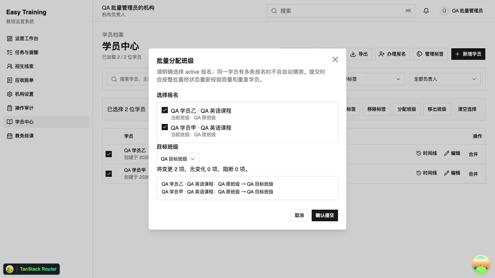
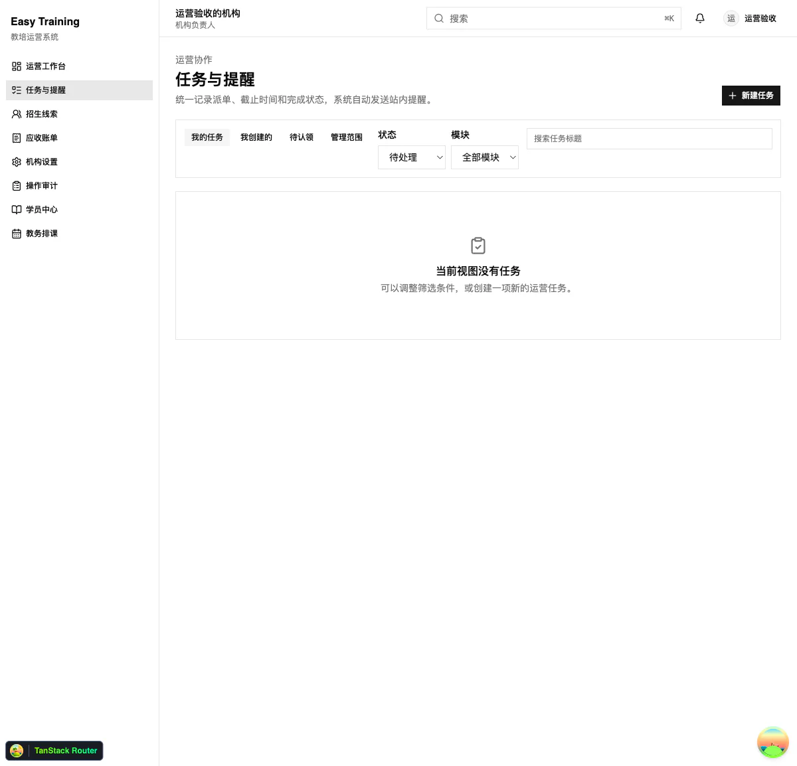

Easy Training 是一个面向多校区教培机构的运营系统。它把招生线索、学员档案、报名、班级、排课、考勤课消和财务收款放在同一套机构上下文中，让不同岗位围绕同一份业务事实协作。

*真实界面：批量分班会先列出选中的有效报名、目标班级和逐项变更，提交时再次校验容量与重复学员。*

## 从招生线索到正式学员

招生线索支持搜索、阶段筛选、负责人跟进和阶段流转。线索转化后，系统建立学员与报名关系，并继续记录入班、冻结、复课、转班和退班等状态变化。

同一个家庭可能用相同手机号多次咨询，学员也可能同时报名不同课程。系统因此把联系人查重、档案合并和报名关系分开处理，避免用一个手机号简单覆盖既有记录。报名、账单、收款、考勤和课消共同进入学员业务时间线，后续处理不需要在多个模块中重新拼接上下文。

*真实界面：运营任务统一承接派单、截止时间和完成状态，并可按本人、创建者、状态与业务模块筛选。*

## 多校区与机构隔离

所有业务数据都属于机构，并进一步受到成员角色和校区范围限制。机构上下文由服务端根据当前会话与成员关系解析，业务接口不接受客户端传入一个机构 ID 来决定数据边界。

招生隐私、财务明细和校区数据会按角色裁剪。涉及考勤、联系人和教师校区关系的子表查询，必须通过父表关联机构条件；仅凭一条记录 ID 不能返回业务数据。例如 `attendance` 要 join 所属 `lesson` 并限制 `lesson.organizationId`，`studentContact` 要 join `student` 校验机构，手机号查重不做全局判重。写入事务还会重新读取成员角色和校区范围，降低请求开始后权限发生变化带来的竞态风险。

生产试运行关闭公开注册。既有机构成员通过绑定邮箱的邀请链接加入，且领取邀请前必须完成邮箱验证；新机构则使用平台签发、与目标邮箱绑定的 onboarding 邀请开通，避免任意注册自动获得机构所有者权限。

## 教务中的冲突与并发

教务模块支持单次排课和每周周期排课，并在提交前预览教师、教室、班级和时间冲突。未来课次可以调课、换教师或换教室，班级可以停课和复课，缺课学员则通过补课流程重新安排。

教师账号可以绑定机构成员，在个人工作台保存点名草稿、完成课次并记录教学小结。排课、点名与课消不是互相独立的页面操作，它们需要在同一事务和状态约束下推进，避免重复完成课次或在并发操作中多扣课时。

## 不静默改写财务事实

报名和续费可以自动形成账单，财务人员也可以受控地手工开单与调整。金额在接口中统一使用“分”，前端输入限制小数位与金额范围，避免浮点计算和各页面口径不一致。

收款之后的退款、冲正和凭证作废不会直接改写原记录。系统保留原始资金事实，再新增对应的反向或后续动作；退款需要审批，收款凭证具备机构内唯一编号，并可以开具、作废、补开和打印。关键动作同时写入机构审计记录。

## 端到端类型与工程边界

项目基于 Better-T-Stack 组织为 TypeScript monorepo，用 pnpm workspace、Turborepo 和 Biome 管理。管理端由 React 19、TanStack Router 和 TanStack Query 构成，界面使用 Tailwind 和共享的 shadcn/ui；Hono 提供服务端入口，oRPC 让前后端共享类型契约并生成 OpenAPI 文档（本地可在 `/api-reference` 查看）；Drizzle 负责 PostgreSQL schema 和 migration，Better Auth 处理邮箱密码认证，邮件通过腾讯云 SES 模板发送且失败不阻塞主流程。

代码按 `apps/{web,server}` 与 `packages/{api,auth,db,env,mail,ui,config}` 划分，机构隔离和工作台等关键路径有 PostgreSQL 集成测试覆盖。本地开发可以使用 `db:push` 初始化可丢弃数据库，生产环境只能应用经过审查并提交到仓库的 migration。破坏性 schema 变化需要经过扩展、回填、兼容读写和收缩阶段，不能把应用回滚等同于数据库回退。

## 当前状态

系统已覆盖招生、学员报名、班级教务、教师工作台、考勤课消、账单收款、退款审批、凭证与运营任务。备份、隔离恢复、健康探针、TLS、主机资源、应用异常和备份健康告警已有试运行记录，并在 2026-07-28 完成过一次不写入业务数据的受控生产冒烟。

当前运行边界仍限定为单实例、受邀制和少量真实机构。隔周排课、节假日例外、附件档案、在线支付、家长端和原生教师移动端尚未覆盖，多实例共享限流与规模化容量验收也未完成，因此项目不承诺生产 SLA。

这个项目的核心经验是：SaaS 的“多租户”不是给表加一个机构字段。权限、查询、事务、邀请、日志、迁移和恢复流程都需要围绕同一条信任边界设计。
